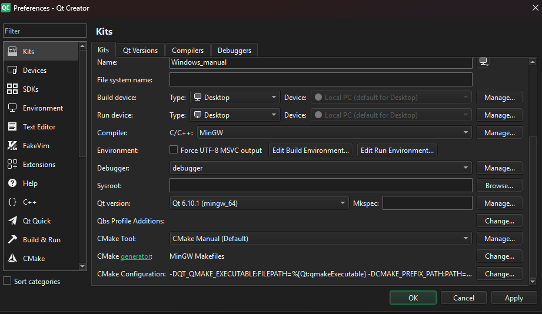

# Proyecto N-Grams (Predictor de Palabras)

Entrega del proyecto de CC1. Es un sistema que predice la siguiente palabra que vas a escribir usando probabilidades (Bigramas).

## ¿Cómo Compilar?

Hay dos formas de probarlo, dependiendo de si quieres ver solo la lógica o la aplicación completa con botones.

### 1. Solo Backend (Consola)
Si quieres probar que el código de C++ y los algoritmos funcionan bien sin la interfaz gráfica, usa esto. Tienes que compilar todos los archivos `.cpp` juntos para que se "linkeen" en un solo ejecutable.

**En Windows**
Entras a la carpeta `Backend` y escribes este comando gigante:

```bash
g++ main.cpp Ngrams/manager/NGramManager.cpp Ngrams/manager/PredictionSession.cpp Ngrams/tipos/bigrams/Bigram.cpp utils/FileManager.cpp utils/TextBuilder.cpp utils/tokenizador.cpp -o main.exe
```
(Y luego ejecutas `main.exe`)

**En Linux:**
```bash
g++ main.cpp Ngrams/manager/NGramManager.cpp Ngrams/manager/PredictionSession.cpp Ngrams/tipos/bigrams/Bigram.cpp utils/FileManager.cpp utils/TextBuilder.cpp utils/tokenizador.cpp -o main
```
(Y luego `./main`)
...

### 2. Interfaz Gráfica (Con Qt)
Esta es la versión completa del proyecto.

1.  Abre el **Qt Creator**.
2.  Le das a "Abrir Proyecto" y buscas el archivo `Frontend/CMakeLists.txt`.
3.  Configuras el Kit (el compilador que tengas instalado).
4.  Le das al botón de **Play** (el triangulito verde) abajo a la izquierda.

### 3. configuracion del Qt Creator
En el caso de que no compile con los valores predeterminados del QT Creator, le mando mi configuracion.

1. compiler: MinGW
2. Qt version: Qt 6.10.1
3. CMake: Cmake manual
4. Cmake generator: MinGW Makefiles
5. Cmake configuration: 
    -DQT_QMAKE_EXECUTABLE:FILEPATH=%{Qt:qmakeExecutable}
    -DCMAKE_PREFIX_PATH:PATH=%{Qt:QT_INSTALL_PREFIX}
    -DCMAKE_C_COMPILER:FILEPATH=%{Compiler:Executable:C}
    -DCMAKE_CXX_COMPILER:FILEPATH=%{Compiler:Executable:Cxx} 

le envio todo esto por que al probar el qt se desconfiguro al instalarlo, y tuve que hacerlo manual, le mando una foto de mis especificaciones:


